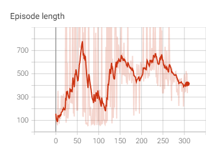
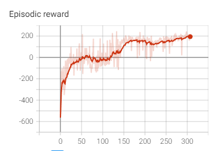
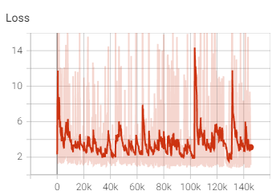

# Q-Learning

A mini project that implements Q-learning and its many optimizations in an object oriented way. The project is available
for multiple OpenAI gym environments.

## Demo

https://user-images.githubusercontent.com/23010176/192074983-ceebd7d5-2e6d-4dab-9963-bb8b375e9f31.mp4

## Performance

## Algorithms / Libraries used
- Pytorch -- ML Library of choice
- Numpy -- Data processing and sampling
- OpenAI Gym -- Reinforcement learning environement library
- Double Q Learning -- Target and Online model for more stable and faster training
- Prioritized Experience Replay (Disabled) -- Prioritizes replay memory based on their error

## References

Hasselt, H., 2021. Double Q-learning. [online] Papers.nips.cc. Available
at: <https://papers.nips.cc/paper/3964-double-q-learning> [Accessed 15 August 2021]. Arxiv.org. 2016. Prioritized

Experience Replay. [online] Available at: <https://arxiv.org/pdf/1511.05952.pdf> [Accessed 15 August 2021].
